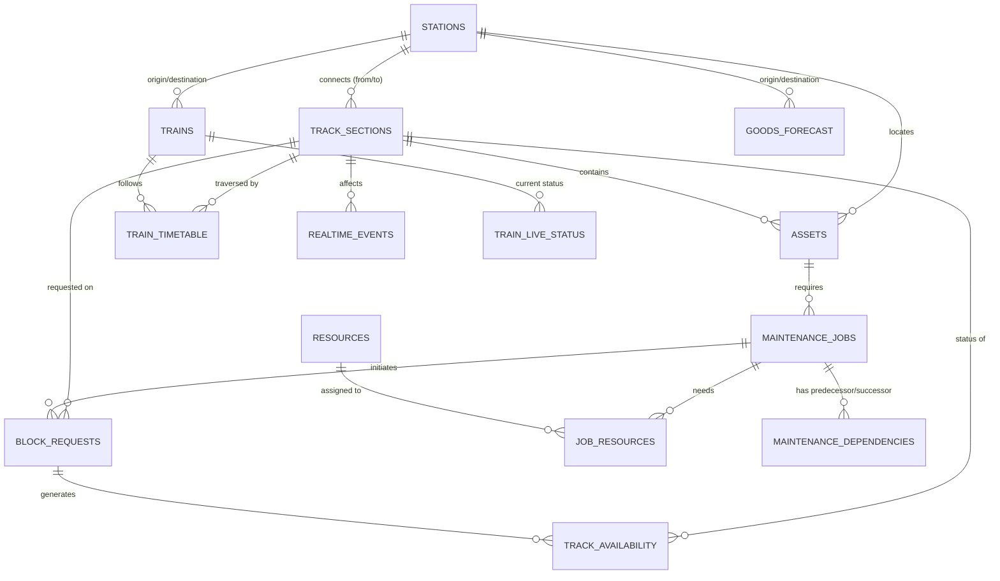

# Entity Relationships

Based exclusively on the provided CSV files, the following relationships form the core data model.

## Primary Entities and Keys
* **Station** (`station_id`)
* **Track Section** (`track_id`)
* **Train** (`train_id`)
* **Asset** (`asset_id`)
* **Maintenance Job** (`job_id`)
* **Block Request** (`request_id`)
* **Resource** (`resource_id`)

## Relationships

## Spatial Joins and Calculations
In a spatial DB (PostGIS), the following elements will need to interact:
1. `01_stations.csv` contains `latitude` and `longitude`.
2. `02_track_sections.csv` connects stations, possessing a physical distance.
3. Assets, Blocks, and Events have `chainage_km` (or offset), which represents a linear distance along a `track_id` from its starting point.

When implementing CP-SAT or ALNS spatial checks, calculating train overlaps against block requests will require converting the temporal bounds of a train within a `track_id` (from `05_train_timetable.csv`) into a spatial-temporal bounding box using the track length and train speed.
